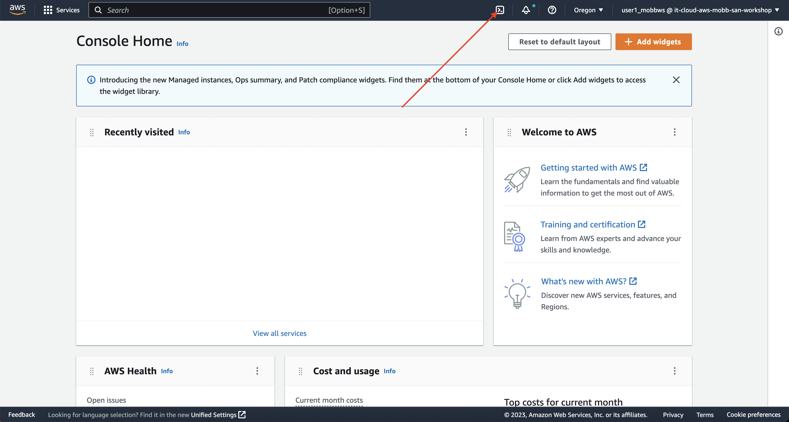
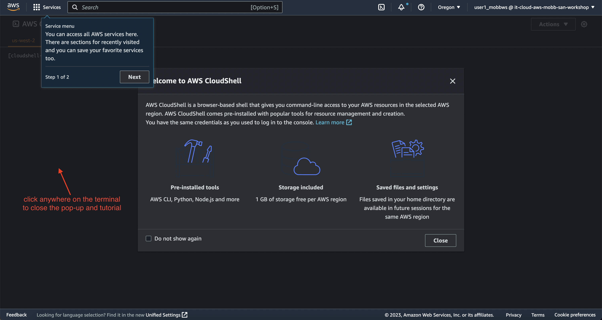

## The Workshop Environment You Are Using

Your workshop environment consists of several components which have been pre-configured and are ready to use. This includes a [Amazon Web Services (AWS)](https://aws.amazon.com){:target="_blank"} account, an [OpenShift Cluster Manager](https://console.redhat.com/openshift){:target="_blank"} account, and many other supporting resources.

To access your working environment, you'll need to log into the AWS Management Console by [clicking here](https://it-cloud-aws-mobb-san-workshop.signin.aws.amazon.com/console){:target="_blank"}.

When prompted, you'll log in with the credentials provided by the workshop team.

!!! warning "Log out of existing AWS sessions"

    While these commands can be run in any AWS account, we've completed many of the prerequisites for you to ensure they work in the workshop environment. As such, we recommend ensuring that you are logged out of any other AWS sessions.

### Pre-created Resources

- IAM user (with login and programmatic access keys)
- Cloud bastion host

### Access the Workshop Environment

You have two options for accessing the workshop environment:

1. Local SSH Client (recommended)
2. AWS CloudShell

#### Option 1: Local SSH Client

Using your local SSH client, connect to the following host:

| Option     | Value                               | Example |
| ----------- | ------------------------------------ | -------- |
| Host       | **bastion.aws.mobb.cloud**  | N/A |
| Port       | **22**                 | N/A |
| Username    | **user#_mobbws** |  **user2_mobbws** |
| Password       | *Use the password provided by the workshop team* | N/A |

For example, if I was using a Linux or Mac terminal, I would run the following command to SSH to the cloud bastion host (making sure to replace the `#` with your assigned user number): 

```
ssh user#_mobbws@bastion.aws.mobb.cloud
```

#### Option 2: AWS CloudShell

AWS CloudShell is recommended for use if your local machine does not have an SSH client or if your corporate network prevents you from egressing to port 22. AWS CloudShell is a browser-accessible shell provided directly in the AWS Management Console. To use AWS CloudShell, ensure you are logged in to the AWS Management Console and follow the steps below. 

1. To start AWS CloudShell, click on the `>_` button at the top right corner of the AWS Management Console.

    { align=center }

1. Next, click anywhere around the pop-up to close the introduction and tutorial.

    { align=center }

1. SSH to the cloud bastion host using the following command (making sure to replace the `#` with your assigned user number):

    ```
    ssh user#_mobbws@bastion.aws.mobb.cloud
    ```

    Enter the password provided by the workshop team when prompted. 

    { align=center }