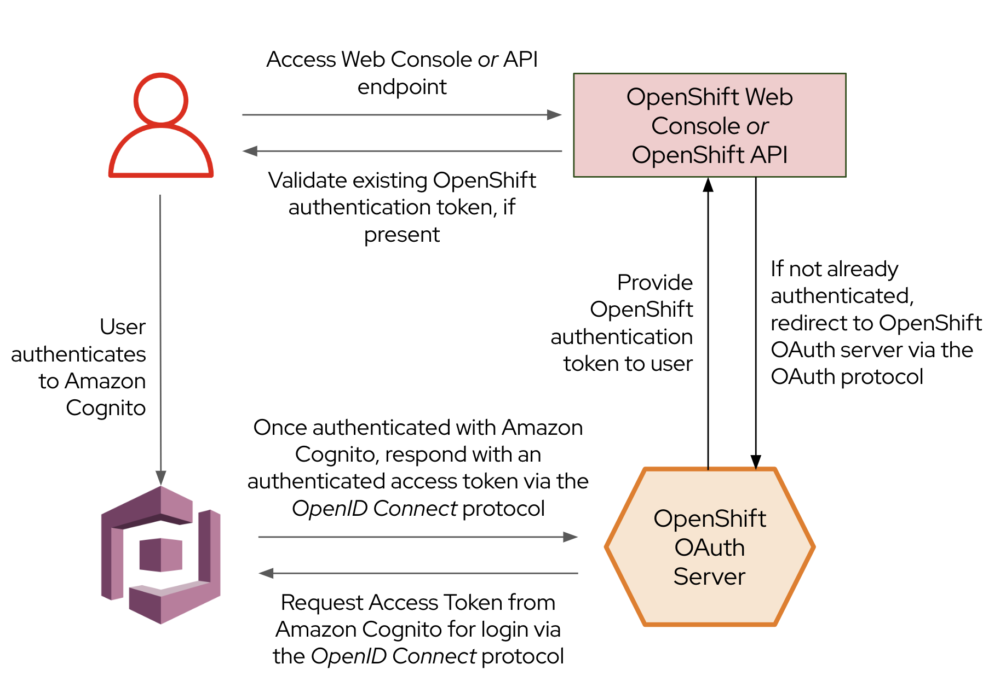

## Introduction

[AWS Cognito](https://aws.amazon.com/cognito/){ align=center } is a fully managed authentication, authorization, and user management service provided by Amazon Web Services (AWS). It simplifies the process of adding user sign-up, sign-in, and access control to your ROSA Cluster.
Integrating ROSA cluster with AWS Cognito simplifies user authentication, provides secure access control, supports federated identity and SSO, and enables centralized user management and audit trails

As part of the [Access Your Cluster](../../100-setup/3-access-cluster/) page, we created a temporary cluster-admin user using the `rosa create admin` command. This uses htpasswd as a local identity provider to allow you to access the cluster. In this section of the workshop, we'll configure Amazon Cognito as the cluster identity provider in your ROSA cluster.

The following diagram illustrates the ROSA authentication process for a cluster configured with Amazon Cognito. 

{ align=center }

To learn more about configuring identity providers for ROSA, visit the [Red Hat documentation on configuring identity providers](https://docs.openshift.com/rosa/rosa_install_access_delete_clusters/rosa-sts-config-identity-providers.html){:target="_blank"}.

## Configure Amazon Cognito

1. First, we need to determine the OpenShift OAuth Server's callback URL, which we will use to tell Amazon Cognito where it should send authentication responses. To do so, run the following command:

    ```bash
    CLUSTER_DOMAIN=$(rosa describe cluster -c ${WS_USER/_/-} | grep "DNS" | grep -oE '\S+.openshiftapps.com')
    echo "OAuth callback URL: https://oauth-openshift.apps.${CLUSTER_DOMAIN}/oauth2callback/Cognito"
    ```

1. Next, let's create an app client in Amazon Cognito and store the `ClientId` parameter for use later. To do so, run the following command:

    ```bash
    echo "export COGNITO_CLIENT_ID=$(aws cognito-idp create-user-pool-client \
    --user-pool-id ${WS_COGNITO_ID} \
    --client-name ${WS_USER/_/-} \
    --generate-secret \
    --callback-urls "https://oauth-openshift.apps.${CLUSTER_DOMAIN}/oauth2callback/Cognito" \
    --supported-identity-providers COGNITO \
    --allowed-o-auth-scopes "phone" "email" "openid" "profile" \
    --allowed-o-auth-flows code \
    --allowed-o-auth-flows-user-pool-client \
    --query UserPoolClient.ClientId \
    --output text)" >> ~/.bashrc
    source ~/.bashrc
    echo "ClientId: ${COGNITO_CLIENT_ID}"
    ```

    The output of the command will look something like this:

    ```{.text, .no-copy}
    ClientId: abcdefghijklmnopqrstuvwxyz
    ```

    If you don't see a client ID, double check that you ran the above commands and then ask for help!

1. Next, let's grab the Cognito `ClientSecret` that was generated in the previous step. To do so, run the following command:

    ```bash
    echo "export COGNITO_CLIENT_SECRET=$(aws cognito-idp describe-user-pool-client \
    --user-pool-id ${WS_COGNITO_ID} \
    --client-id ${COGNITO_CLIENT_ID} \
    --query UserPoolClient.ClientSecret \
    --output text)" >> ~/.bashrc
    source ~/.bashrc
    echo "ClientSecret: ${COGNITO_CLIENT_SECRET}"
    ```

    The output of the command will look something like this:

    ```{.text, .no-copy}
    ClientSecret: redacted
    ```

    If you don't see a client secret, ask for help!

## Configure ROSA
1. Finally, we need to configure ROSA to use Amazon Cognito as its identity provider. While ROSA offers the ability to configure identity providers via OpenShift Cluster Manager (OCM), we're going to configure the cluster’s OAuth provider via the `rosa` CLI instead. To do so, we'll use the information we gathered in the above steps (`ClientId` and `ClientSecret`), and create our ROSA IdP configuration by running the following command: 

    ```bash
    rosa create idp \
    --cluster ${WS_USER/_/-} \
    --type openid \
    --name Cognito \
    --client-id ${COGNITO_CLIENT_ID} \
    --client-secret $(aws cognito-idp describe-user-pool-client --user-pool-id ${WS_COGNITO_ID} --client-id ${COGNITO_CLIENT_ID} --query UserPoolClient.ClientSecret --output text) \
    --issuer-url https://cognito-idp.{{ aws_region }}.amazonaws.com/${WS_COGNITO_ID} \
    --email-claims email \
    --name-claims name \
    --username-claims preferred_username
    ```

1. Logout from your OpenShift Web Console and browse back to the Console URL (`rosa describe cluster -c ${WS_USER/_/-} -o json | jq -r '.console.url'` if you have forgotten it) and you should see a new option to login called `Cognito`. Select that, and log in using your workshop AWS credentials.

    !!! warning "If you do not see a new **Cognito** login option, wait a few more minutes as this process can take a few minutes to deploy across the cluster and revisit the Console URL."

1. Next, let's give Cluster Admin permissions to your Amazon Cognito user by running the following commands:

    ```bash
    oc adm policy add-cluster-role-to-user \
      cluster-admin $(oc get users | grep User | awk '{print $1}')
    ```

    !!! note "You're logged in to the OpenShift CLI already, so you can run this command. You can also grant these permissions via the rosa CLI by using the `rosa grant user cluster-admin` command."

1. Logout from your OpenShift Web Console and browse back to the Console URL.  We do this to refresh our session and get the Admin access.

Congratulations! You've successfully configured your Red Hat OpenShift Service on AWS (ROSA) cluster to authenticate with Amazon Cognito.

## Summary and Next Steps

Here you learned:

* Configure Amazon Cognito to act as the ROSA identity provider
* Configure your ROSA cluster to use Amazon Cognito for authentication
* Grant your workshop user `cluster-admin` privileges in ROSA cluster

