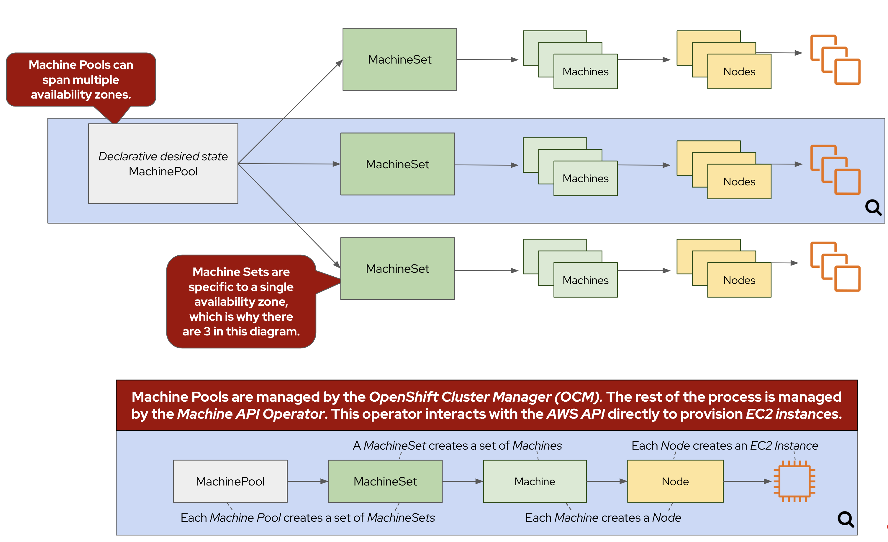

## Introduction

When deploying your ROSA cluster, you can configure many aspects of your worker nodes, but what happens when you need to change your worker nodes after they've already been created? These activities include scaling the number of nodes, changing the instance type, adding labels or taints, just to name a few.

Many of these changes are done using Machine Pools. Machine Pools ensure that a specified number of Machine replicas are running at any given time. Think of a Machine Pool as a "template" for the kinds of Machines that make up the worker nodes of your cluster. If you'd like to learn more, see the [Red Hat documentation on worker node management](https://docs.openshift.com/rosa/rosa_cluster_admin/rosa_nodes/rosa-managing-worker-nodes.html){:target="_blank"}.

Here are some of the advantages of using ROSA Machine Pools to manage the size of your cluster

* Scalability - ROSA Machine Pool enables horizontal scaling of your cluster. It can easily add or remove worker to handle the changes in workload. This flexibility ensures that your cluster can dynamically scale to meet the needs of your applications
* High Availability - ROSA Machine Pool supports the creation of 3 replicas of workers across different availability zones. This redundancy helps ensure high availability of applications by distributing workloads.
* Infrastructure Diversity - ROSA Machine Pool allow you to provision worker nodes of different instance type. This enables you you leverage the best kind of instance family for different workloads.
* Integration with Cluster Autoscaler - ROSA Machine Pool seamlessly integrate with the Cluster Autoscaler feature, which automatically adjusts the number of worker nodes based on the current demand. This integration ensures efficient resource utilization by scaling the cluster up or down as needed, optimizing costs and performance.

{ align=center }

## Scaling worker nodes
### Via the CLI

1. First, let's see what MachinePools already exist in our cluster. To do so, run the following command:

    ```bash
    rosa list machinepools -c ${WS_USER/_/-}
    ```

    Your output should look similar to:

    ```{.text .no-copy}
    ID       AUTOSCALING  REPLICAS  INSTANCE TYPE  LABELS    TAINTS    AVAILABILITY ZONES                    SUBNETS    SPOT INSTANCES
    Default  No           3         m5.xlarge                          {{ aws_region }}a, {{ aws_region }}b, {{ aws_region }}c               N/A
    ```

1. Now, let's take a look at the machines inside of the ROSA cluster that have been created according to the instructions provided by the above MachinePools. To do so, run the following command:

    ```bash
    oc -n openshift-machine-api get machine
    ```

    For this workshop, we've deployed your ROSA cluster with nine total machines (three workers, three control planes, and three infrastructure nodes), one in each availability zone. The output will look something like this:

    ```{.text .no-copy}
    NAME                                         PHASE     TYPE         REGION      ZONE         AGE
    user1-mobbws-6sj5f-infra-{{ aws_region }}a-cb56h    Running   r5.xlarge    {{ aws_region }}   {{ aws_region }}a   18h
    user1-mobbws-6sj5f-infra-{{ aws_region }}b-t6bdg    Running   r5.xlarge    {{ aws_region }}   {{ aws_region }}b   18h
    user1-mobbws-6sj5f-infra-{{ aws_region }}c-9v4pq    Running   r5.xlarge    {{ aws_region }}   {{ aws_region }}c   18h
    user1-mobbws-6sj5f-master-0                  Running   m5.2xlarge   {{ aws_region }}   {{ aws_region }}a   18h
    user1-mobbws-6sj5f-master-1                  Running   m5.2xlarge   {{ aws_region }}   {{ aws_region }}b   18h
    user1-mobbws-6sj5f-master-2                  Running   m5.2xlarge   {{ aws_region }}   {{ aws_region }}c   18h
    user1-mobbws-6sj5f-worker-{{ aws_region }}a-jrxnz   Running   m5.xlarge    {{ aws_region }}   {{ aws_region }}a   18h
    user1-mobbws-6sj5f-worker-{{ aws_region }}b-2j8lc   Running   m5.xlarge    {{ aws_region }}   {{ aws_region }}b   18h
    user1-mobbws-6sj5f-worker-{{ aws_region }}c-w8jl6   Running   m5.xlarge    {{ aws_region }}   {{ aws_region }}c   18h
    ```

1. Now that we know that we have three worker nodes, let's create a MachinePool to add a new worker node using the ROSA CLI. To do so, run the following command:

    ```bash
    rosa create machinepool -c ${WS_USER/_/-} --availability-zone ${AWS_DEFAULT_REGION}a --replicas 1 --name workshop --instance-type m5.xlarge
    ```

    The output of the command should look something like this:

    ```{.text .no-copy}
    I: Fetching instance types
    I: Machine pool 'workshop' created successfully on cluster 'user1-mobbws'
    I: To view all machine pools, run 'rosa list machinepools -c user1-mobbws'
    ```

    This command adds a single m5.xlarge instance to the {{ aws_region }}a availability zone. 

1. Now, let's scale up our selected MachinePool from one to two machines. To do so, run the following command:

    ```bash
    rosa update machinepool -c ${WS_USER/_/-} --replicas 2 workshop
    ```

    Your output should look like this:

    ```{.text .no-copy}
    I: Updated machine pool 'workshop' on cluster 'user1-mobbws'
    ```

1. Now that we've scaled the MachineSet to two machines, we can see that the machine is already being created. First, let's quickly check the output of the same command we ran in step 1:

    ```bash
    oc -n openshift-machine-api get machinesets
    ```

    The output should look something like this:

    ```{.text .no-copy}
    NAME                                      DESIRED   CURRENT   READY   AVAILABLE   AGE
    user1-mobbws-6sj5f-infra-{{ aws_region }}a       1         1         1       1           18h
    user1-mobbws-6sj5f-infra-{{ aws_region }}b       1         1         1       1           18h
    user1-mobbws-6sj5f-infra-{{ aws_region }}c       1         1         1       1           18h
    user1-mobbws-6sj5f-worker-{{ aws_region }}a      1         1         1       1           19h
    user1-mobbws-6sj5f-worker-{{ aws_region }}b      1         1         1       1           19h
    user1-mobbws-6sj5f-worker-{{ aws_region }}c      1         1         1       1           19h
    user1-mobbws-6sj5f-workshop-{{ aws_region }}a    2         2         1       1           4m36s
    ```

    Note, that the number of `DESIRED` and `CURRENT` nodes matches the scale we specified, but only one is *ready* and *available*. If you wait a couple of minutes, `READY` and `AVAILABLE` count will also go to two

    We can also run the same command we ran in step 2 to see the machine being provisioned:

    ```bash
    oc -n openshift-machine-api get machine
    ```

    The output should look something like this:

    ```{.text .no-copy}
    NAME                                            PHASE         TYPE         REGION      ZONE         AGE
    user1-mobbws-6sj5f-infra-{{ aws_region }}a-cb56h       Running       r5.xlarge    {{ aws_region }}   {{ aws_region }}a   18h
    user1-mobbws-6sj5f-infra-{{ aws_region }}b-t6bdg       Running       r5.xlarge    {{ aws_region }}   {{ aws_region }}b   18h
    user1-mobbws-6sj5f-infra-{{ aws_region }}c-9v4pq       Running       r5.xlarge    {{ aws_region }}   {{ aws_region }}c   18h
    user1-mobbws-6sj5f-master-0                     Running       m5.2xlarge   {{ aws_region }}   {{ aws_region }}a   19h
    user1-mobbws-6sj5f-master-1                     Running       m5.2xlarge   {{ aws_region }}   {{ aws_region }}b   19h
    user1-mobbws-6sj5f-master-2                     Running       m5.2xlarge   {{ aws_region }}   {{ aws_region }}c   19h
    user1-mobbws-6sj5f-worker-{{ aws_region }}a-jrxnz      Running       m5.xlarge    {{ aws_region }}   {{ aws_region }}a   18h
    user1-mobbws-6sj5f-worker-{{ aws_region }}b-2j8lc      Running       m5.xlarge    {{ aws_region }}   {{ aws_region }}b   18h
    user1-mobbws-6sj5f-worker-{{ aws_region }}c-w8jl6      Running       m5.xlarge    {{ aws_region }}   {{ aws_region }}c   18h
    user1-mobbws-6sj5f-workshop-{{ aws_region }}a-6gz7w    Provisioned   m5.xlarge    {{ aws_region }}   {{ aws_region }}a   51s
    user1-mobbws-6sj5f-workshop-{{ aws_region }}a-xh584    Running       m5.xlarge    {{ aws_region }}   {{ aws_region }}a   3m43s
    ```

1. Now let's scale the cluster back down to a total of 4 worker nodes by scaling down the "Workshop" Machine Pool. To do so, run the following command:

    ```
    rosa update machinepool -c ${WS_USER/_/-} --replicas 1 workshop
    ```

1. Now that we've scaled the MachineSet back down to one machines, we can see the change reflected in the cluster almost immediately. Let's quickly check the output of the same command we ran in step 5:

    ```bash
    oc -n openshift-machine-api get machinesets
    ```

    The output should look something like this:

    ```{.text .no-copy}
    NAME                                      DESIRED   CURRENT   READY   AVAILABLE   AGE
    user1-mobbws-6sj5f-infra-{{ aws_region }}a       1         1         1       1           18h
    user1-mobbws-6sj5f-infra-{{ aws_region }}b       1         1         1       1           18h
    user1-mobbws-6sj5f-infra-{{ aws_region }}c       1         1         1       1           18h
    user1-mobbws-6sj5f-worker-{{ aws_region }}a      1         1         1       1           19h
    user1-mobbws-6sj5f-worker-{{ aws_region }}b      1         1         1       1           19h
    user1-mobbws-6sj5f-worker-{{ aws_region }}c      1         1         1       1           19h
    user1-mobbws-6sj5f-workshop-{{ aws_region }}a    1         1         1       1           4m36s
    ```

1. Now let's scale the cluster back down to a total of 3 worker nodes by deleting the "Workshop" Machine Pool. To do so, run the following command:

    ```
    rosa delete machinepool -c ${WS_USER/_/-} workshop --yes
    ```

Congratulations! You've successfully scaled your cluster up and back down to three nodes.

## Summary and Next Steps

Here you learned:

* Creating new machinepool for your Red Hat OpenShift on AWS cluster
* Scaling machinepool up to add more worker to the cluster
* Scaling machinepool down to remove worker from the cluster 

Next you will learn:

* Cluster Autoscaling
