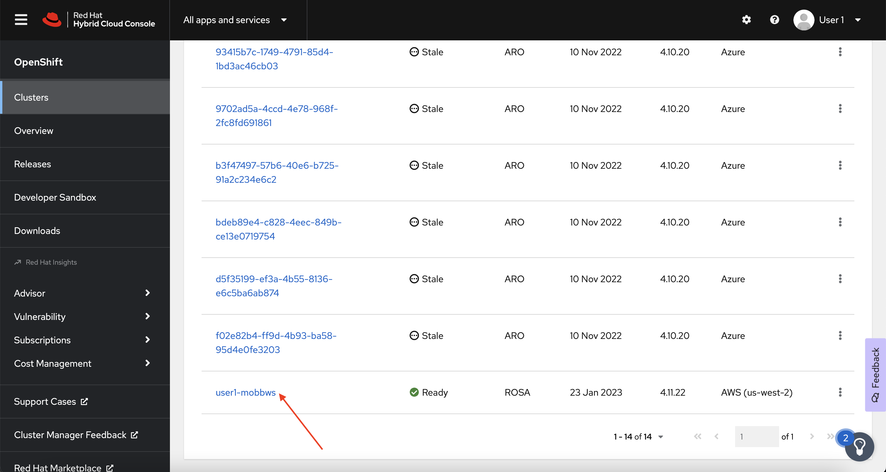
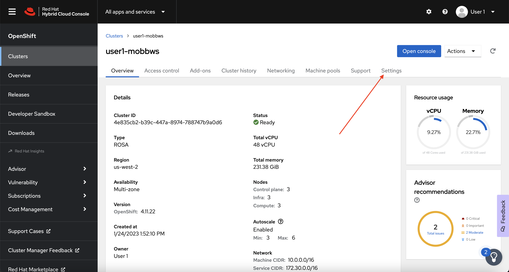
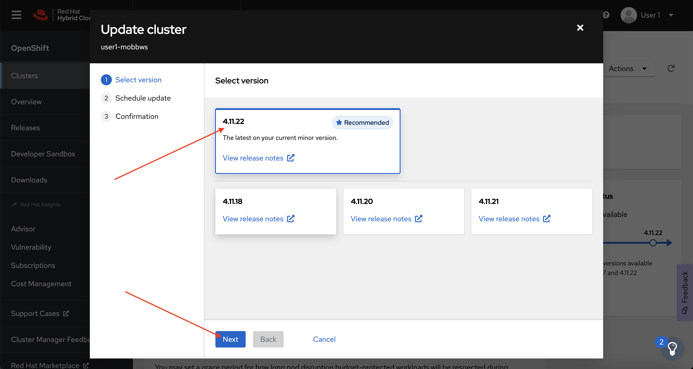
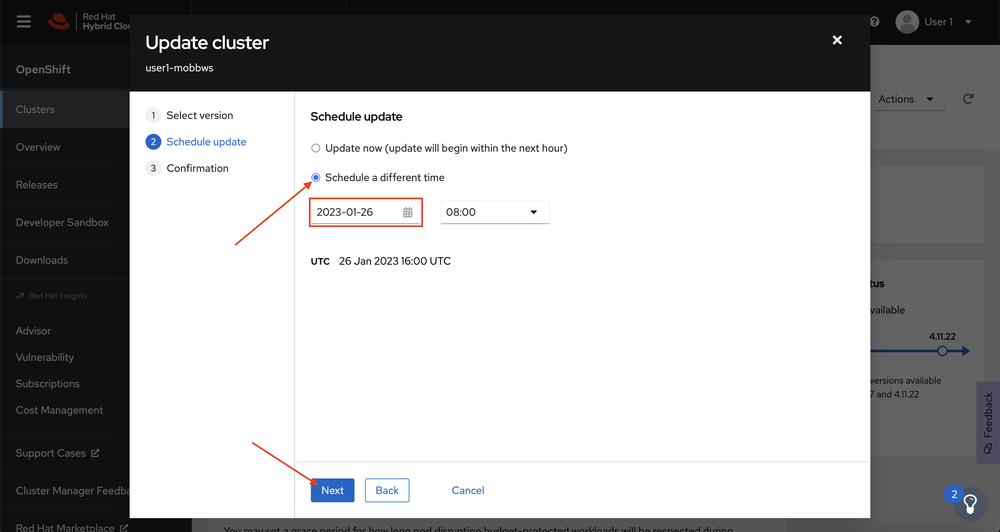
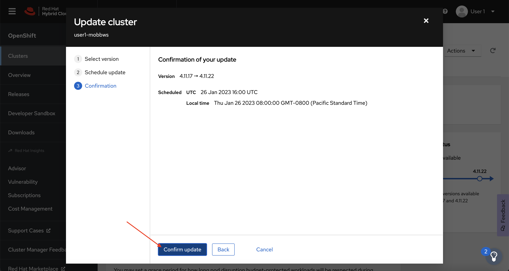
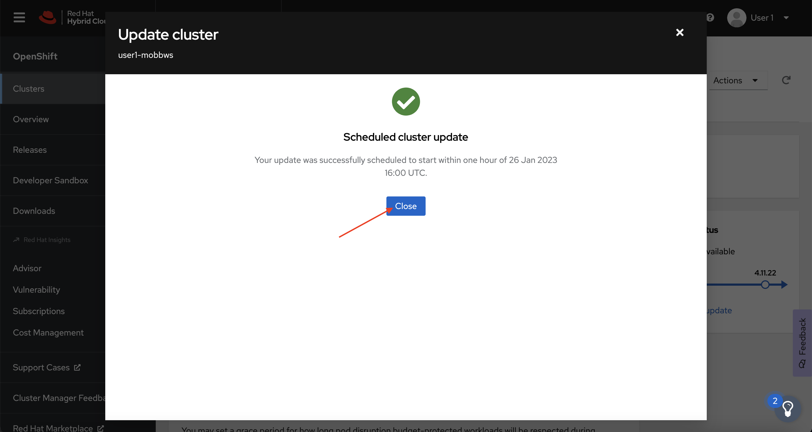

## Introduction

Red Hat OpenShift Service on AWS (ROSA) provides fully-managed cluster updates. These updates can be scheduled from the OpenShift Cluster Manager or from the ROSA CLI. All updates are monitored and managed by the Red Hat ROSA SRE team.

For more information on how ROSA's Upgrade Service works, please see the [Red Hat documentation](https://docs.openshift.com/rosa/upgrading/rosa-upgrading-sts.html){:target="_blank"}.

## Upgrade using the OpenShift Cluster Manager

!!! note

    It is important to note, that even though we are upgrading via the OpenShift Cluster Manager, this can also be done via the ROSA CLI. 

1. Log back into the OpenShift Cluster Manager by [clicking here](https://console.redhat.com/openshift). If you need to reauthenticate, use the credentials provided by the workshop team. 

1. In the *Clusters* section, locate your cluster and click on it. 

    { align=center }

1. Next, click on the *Settings* tab. 

    { align=center }

1. Next, select the *Update* button in the *Update status* sidebar. 

    { align=center }

1. Now, you're presented with a number of versions. For this exercise, we'll select the recommended version, and then hit *Next*.

    { align=center }

1. Next, choose to *Schedule a different time* and change the date box to 1 day from now, then select *Next*.

    { align=center }

1. Finally, select the *Confirm Update* button and then the *Close* button.

    { align=center }
    { align=center }

    Congratulations! You've successfully scheduled an upgrade of your cluster for tomorrow at this time. While the workshop environment will be deleted before then, you now have the experience to schedule upgrades in the future.
