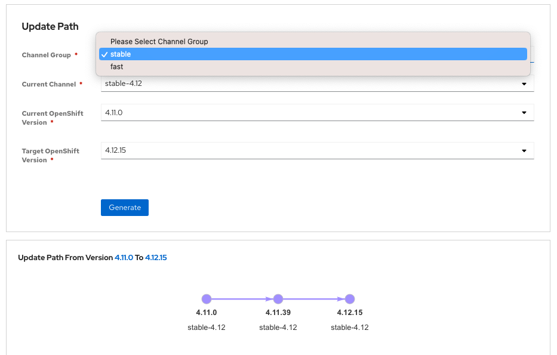

## Introduction

Red Hat OpenShift Service on AWS (ROSA) provides fully-managed cluster updates. These updates can be scheduled from the OpenShift Cluster Manager or from the ROSA CLI. All updates are monitored and managed by the ROSA Site Reliability Engineering (SRE) team. 

## Upgrade using the OpenShift Cluster Manager

!!! note

    It is important to note, that even though we are upgrading via the OpenShift Cluster Manager, this can also be done via the ROSA CLI. 

1. Log back into the OpenShift Cluster Manager by [clicking here](https://console.redhat.com/openshift){:target="_blank"}. If you need to reauthenticate, use the credentials provided by the workshop team. 

1. In the *Clusters* section, locate your cluster and click on it. 

    { align=center }

1. Next, click on the *Settings* tab. 

    { align=center }

1. Next, select the *Update* button in the *Update status* sidebar. 

    { align=center }

1. Now, you're presented with a number of versions. For this exercise, we'll select the recommended version, and then hit *Next*.

    { align=center }

1. Next, choose to *Schedule a different time* and change the date box to 1 day from now, then select *Next*.

    { align=center }

1. Finally, select the *Confirm Update* button and then the *Close* button.

    { align=center }
    { align=center }

    Congratulations! You've successfully scheduled an upgrade of your cluster for tomorrow at this time. While the workshop environment will be deleted before then, you now have the experience to schedule upgrades in the future.

## Additional Resources

### Red Hat OpenShift Upgrade Graph Tool
Occasionally, you may be not be able to go directly from your current version to a desired version. In these cases, you must first upgrade your cluster from your current version, to an intermediary version, and then to your desired version. To help you navigate these decisions, you can take advantage of the [Red Hat OpenShift Upgrade Graph Tool](https://access.redhat.com/labs/ocpupgradegraph/update_path_rosa){:target="_blank"}. 

{ align=center } 

In this scenario to upgrade your cluster from version 4.11.0 to 4.12.15, you must first upgrade to 4.11.39, then you can upgrade to 4.12.15. The ROSA Upgrade Graph Tool helps you easily see which version you should upgrade to. 

### Links to Documentation
- [Upgrading ROSA clusters with STS](https://docs.openshift.com/rosa/upgrading/rosa-upgrading-sts.html){:target="_blank"}
- [Scheduling individual upgrades through the OpenShift Cluster Manager console](https://docs.openshift.com/rosa/upgrading/rosa-upgrading-sts.html#rosa-upgrade-ocm_rosa-upgrading-sts){:target="_blank"}
- [About the OpenShift Update Service](https://docs.openshift.com/container-platform/{{ rosa_version }}/updating/understanding-openshift-updates.html#update-service-about_understanding-openshift-updates){:target="_blank"}

## Summary and Next Steps

Here you learned:

* All upgrades are monitored and managed by Red Hat ROSA SRE Team
* Use ROSA Upgrade Path utility to find valid upgrade path 
* Schedule Red Hat OpenShift on AWS cluster upgrades 

Next you will learn:

* Managing Worker Nodes
