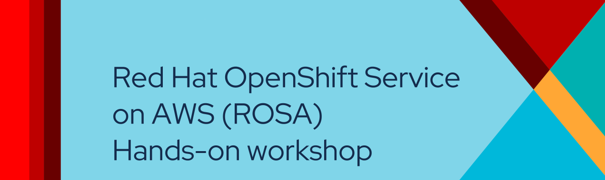

---
hide:
  - toc
---
{ align=center }

<!-- ## Overview -->
Join Red Hat for a hands-on workshop with Red Hat OpenShift Service on AWS (ROSA). During the event, Red Hat Cloud Services experts will guide you through the ROSA architecture and will answer your questions.

**Who should attend:** This full-day, in-person workshop is ideal for developers, architects and operations engineers who need a flexible and proven platform to build, deploy and scale applications.

**What to expect:** During the workshop, we will take you through a series of content to help you understand some of the concepts of deploying container-based applications on Red Hat OpenShift Service on AWS and how to operate an Red Hat OpenShift Service on AWS cluster. We will cover the following:

- Deploy a Red Hat OpenShift Service on AWS (ROSA) cluster
- Complete Day 2 operations tasks including: 
    * Configuring node and cluster scaling policies
    * configuring managed upgrades
    * Configuring single-sign-on for the cluster
    * Configuring log forwarding to AWS CloudWatch
- Deploy an application using CI/CD tooling, including OpenShift GitOps and Source-to-Image, and use labels for deterministic app placement on nodes.
- Deploy an application that uses IAM Roles for Service Accounts and AWS STS to connect to an Amazon DynamoDB table
- Make an application on OpenShift scalable and resistant to node failures and upgrades
- Learn how to use OpenShift Service Mesh for application observability and tracing

Get experience with, and an informed view of Red Hat OpenShift Service on AWS.
